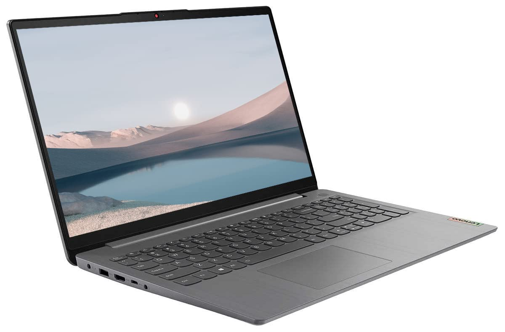

# Recommendation

RAM: 8 GB (the model tested in the review) and also available with 4 GB.
CPU: Intel 11th Gen processor (exact model not specified).
Battery Life: Real-world battery life is closer to around 7 hours on average, despite Microsoft's claim of 13.5 hours.

The Microsoft Surface Laptop Go 2 is a budget-friendly alternative to a MacBook, offering a sleek clamshell design with a super slim profile and stylish lightweight aluminum finish. Available in a range of vibrant colors, it combines visual appeal with practicality, making it a joy to use and carry around. While it may not match the MacBook in terms of price, it provides a premium look and feel, making it an excellent choice for those who desire a MacBook-like experience without the higher cost.

RAM: 8 GB (DDR4)
CPU: Intel Core i5-1235U (12th Generation)
Battery Life: 6-7 hours of light use

 Lenovo Ideapad is a budget-friendly laptop aimed at consumers, offering a 15.6-inch full HD screen and an Intel Core i5-1235U processor. While lacking premium features, it provides decent performance and features for online and homework-related tasks.

The laptop features a simple design with an Arctic Gray ABS plastic chassis. Its build quality is fair, but it may exhibit some flex under pressure. The tested model combines a 12th Generation Core i5 processor, 8GB of DDR4 memory, and a 512GB PCIe SSD. Notably, it comes with Windows 11 Pro instead of the usual Windows 11 Home found in consumer laptops.

The laptop's 15.6-inch non-touch screen has a resolution of 1920x1080 pixels. While it may appear slightly dim, it is still suitable for comfortable use. The keyboard is backlit and includes a numeric keypad, although the arrangement of the cursor arrow keys is less ideal. The laptop offers a good selection of ports, including USB 3.2 ports, an HDMI port, an audio jack, and an SD card slot.

Performance tests indicate that the IdeaPad 3i performs satisfactorily for office tasks, web browsing, and other everyday activities. However, it may not excel in processor-intensive workloads. The display quality is decent, although colors may appear slightly washed out.
